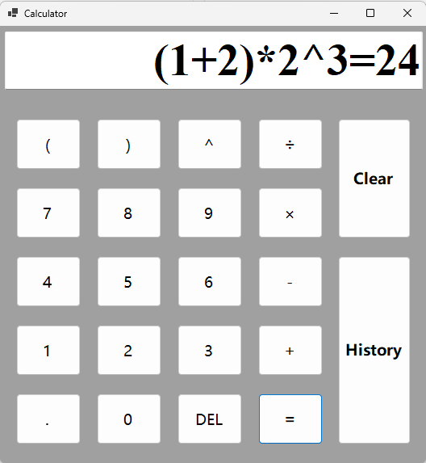

<h1 align="center">SimpleCalculator</h1>

  <strong>&#128515; Maybe the Most Simple Calculator in the World &#128517;</strong> 
  A simple calculator with historical query function. 
  Available for Windows only.

 

  <!-- Downloads total -->
  
  <!-- Downloads latest release -->
  

  <h3>
    <a href="https://github.com/NewlyBuiltDocument/simple-calculator">
      Website
    </a>
     | 
    <a href="https://github.com/NewlyBuiltDocument/simple-calculator#features">
      Features
    </a>
     | 
    <a href="https://github.com/NewlyBuiltDocument/simple-calculator#contributors">
      Contributors
    </a>
  </h3>

---

## Prerequisites
[.NET 8.0](https://dotnet.microsoft.com/download)

---

## Screenshot
 | Calculator Form                          |History Form                         |
 | :--------------------------------------: | :---------------------------------: |
 |  |  |

--- 

## Features
- Realize power arithmetic and parenthesis
- Support historical query function

---

## Contributors
Thank you to all the people who have already contributed to SimpleCalculator[[contributors](https://github.com/NewlyBuiltDocument/simple-calculator/graphs/contributors)].

