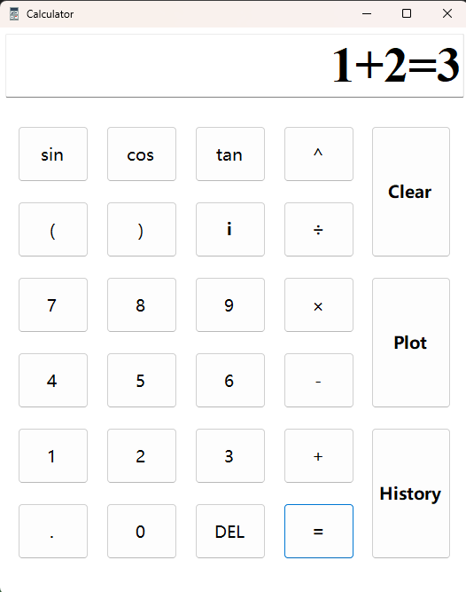
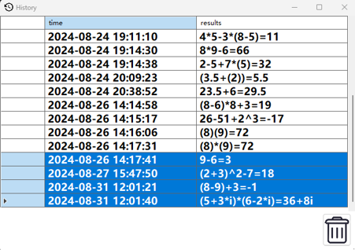
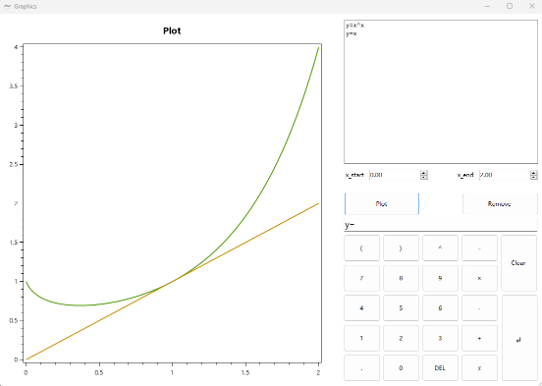

<p align="center"></p>

<h1 align="center">SimpleCalculator Plus</h1>

<div align="center">
  <strong>&#128515; Unluckly not the Most Simple Calculator in the World &#128517;</strong><br>
  A simple calculator supporting ploting and complex number operation.<br>
  <sub>Available for Windows only.</sub>
</div>

<br>

<div align="center">
  <!-- Downloads total -->
  <a href="https://github.com/NewlyBuiltDocument/simple-calculator/releases">
    
  </a>
  <!-- Downloads latest release -->
  <a href="https://github.com/NewlyBuiltDocument/simple-calculator/releases/latest">
    
  </a>
</div>

<div align="center">
  <h3>
    <a href="https://github.com/NewlyBuiltDocument/simple-calculator">
      Website
    </a>
    <span> | </span>
    <a href="https://github.com/NewlyBuiltDocument/simple-calculator#features">
      Features
    </a>
    <span> | </span>
    <a href="https://github.com/NewlyBuiltDocument/simple-calculator#contributors">
      Contributors
    </a>
  </h3>
</div>

---

## Getting Started
### Prerequisites

- [.NET 8.0](https://dotnet.microsoft.com/zh-cn/download)

### Installation

1. Download .NET 8.0 at [https://dotnet.microsoft.com/zh-cn/download](https://dotnet.microsoft.com/zh-cn/download)
2. Clone the repo
   ```sh
   git clone https://github.com/NewlyBuiltDocument/simple-calculator.git
   ```
5. Change git remote url to avoid accidental pushes to base project
   ```sh
   git remote set-url origin github_username/repo_name
   git remote -v # confirm the changes
   ```

---

## Screenshot
 |Calculator Form                          |History Form                       |Graphics Form                        |
 |:---------------------------------------:|:---------------------------------:|:-----------------------------------:|
 ||||

--- 

## Features
- Realize complex number operation
- Support plot function

---

## Contributors
Thank you to all the people who have already contributed to SimpleCalculator[[contributors](https://github.com/NewlyBuiltDocument/simple-calculator/graphs/contributors)].

---

## License
Distributed under the `Apache-2.0` License. See `LICENSE.txt` for more information.
